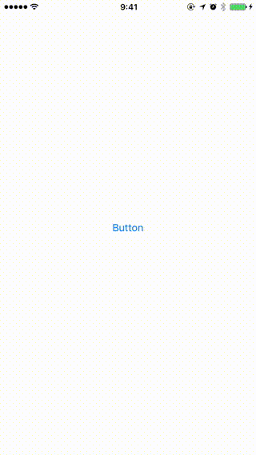

# SwiftShareBubbles

[](http://cocoapods.org/pods/SwiftShareBubbles)
[](http://cocoapods.org/pods/SwiftShareBubbles)
[](http://cocoapods.org/pods/SwiftShareBubbles)
[](https://github.com/Carthage/Carthage)
[](https://www.bitrise.io)

Animated Social share buttons control for iOS written in Swift.
This library is inspired [AAShareBubbles](https://github.com/mixdesign/AAShareBubbles). 



I tried AAShareBubbles with Swift, it mostly worked. But I cannot use AAShareBubbles(Objective-c code) in protocol extension. So I created SwiftShareBubbles in pure Swift.

## Requirements

iOS 8.0 or later, written in Swift.

## Installation

### Cocoapods

```ruby
pod 'SwiftShareBubbles'
```

### Carthage

SwiftRoutes is compatible with [Carthage](https://github.com/Carthage/Carthage). Add it to your `Cartfile`:

```ruby
github "takecian/SwiftShareBubbles"
```

## Usage

1. Instantiate SwiftShareBubbles, specify center position and radius of Circle.
1. Choose social buttons to be shown.
1. Set delegate
1. Call show method.

```swift
class ViewController: UIViewController, SwiftShareBubblesDelegate {

    var bubbles: SwiftShareBubbles?
    
    override func viewDidLoad() {
        super.viewDidLoad()
        bubbles = SwiftShareBubbles(point: CGPoint(x: view.frame.width / 2, y: view.frame.height / 2), radius: 100, in: view)
        bubbles?.showBubbleTypes = [Bubble.twitter, Bubble.line, Bubble.safari]
        bubbles?.delegate = self
    }

    // SwiftShareBubblesDelegate
    func bubblesTapped(bubbles: SwiftShareBubbles, bubbleId: Int) {
        if let bubble = Bubble(rawValue: bubbleId) {
            print("\(bubble)")
            switch bubble {
            case .facebook:
                break
            case .twitter:
                if SLComposeViewController.isAvailable(forServiceType: SLServiceTypeTwitter) {
                    guard let composer = SLComposeViewController(forServiceType: SLServiceTypeTwitter) else { return }
                    composer.setInitialText("test test")
                    present(composer, animated: true, completion: nil)
                }
                break
            case .line:
                break
            default:
                break
            }
        } else {
            // custom case
        }
    }

    func bubblesDidHide(bubbles: SwiftShareBubbles) {
    }

    @IBAction func buttonTapped(_ sender: Any) {
        bubbles?.show()
    }
}

```


## Supported buttons

* facebook
* Twitter
* LINE
* google plus
* Youtube
* Instagram
* Pintereset
* Whatsapp
* Linkedin
* Weibo
* Safari 

## Custom icons

You can add custom icons as follows,

```swift
class ViewController: UIViewController, SwiftShareBubblesDelegate {

    var bubbles: SwiftShareBubbles?
    let customBubbleId = 100
    override func viewDidLoad() {
        super.viewDidLoad()
        ...
	    let customAttribute = ShareAttirbute(bubbleId: customBubbleId, icon: UIImage(named: "Custom")!, backgroundColor: UIColor.white)
	    bubbles?.customBubbleAttributes = [customAttribute]
        bubbles?.delegate = self
    }

     func bubblesTapped(bubbles: SwiftShareBubbles, bubbleId: Int) {
        if customBubbleId == bubbleId {
            // custom case
            print("custom tapped")
        }
    }
}
```


## License

MIT
